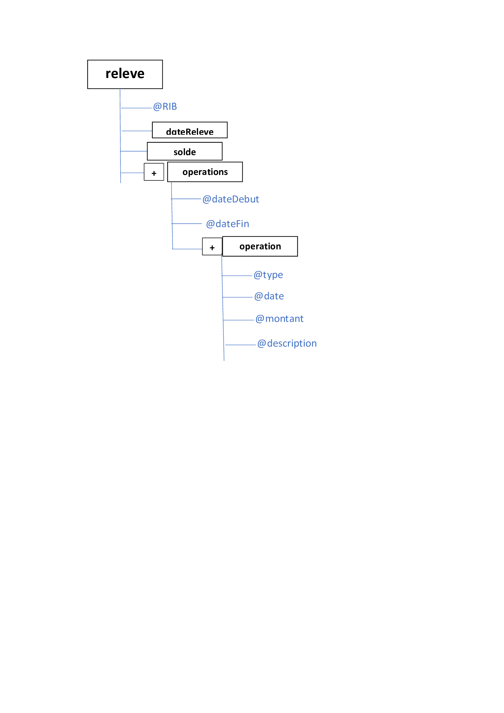
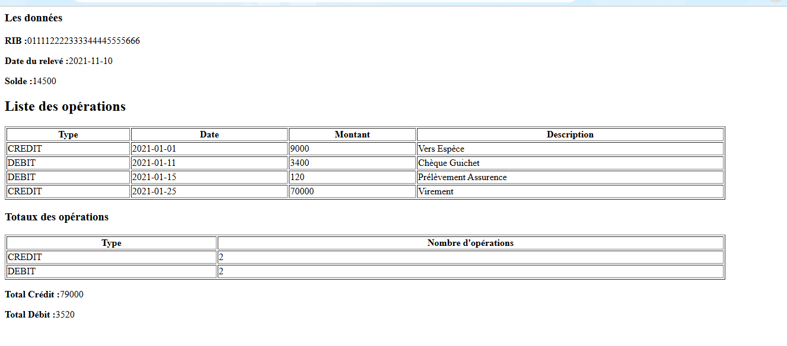
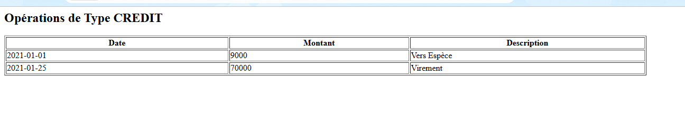

# Projet Gestion de Relevés Bancaires - Technologie XML

## Présentation

Ce projet consiste à gérer des relevés de comptes bancaires au format XML.  
Les données sont structurées selon un format précis et doivent pouvoir être affichées en HTML grâce à des feuilles de style XSL.

---

## 1. Structure graphique de l’arbre XML

La structure de l’arbre XML est illustrée ci-dessous :

---

## 2. Feuille de style XSL pour afficher toutes les données

Cette feuille de style XSL permet d’afficher toutes les données du relevé bancaire au format HTML.  
Elle affiche également le total des opérations de débit et le total des opérations de crédit.

---

## 3. Feuille de style XSL pour afficher uniquement les opérations de type CREDIT

Cette feuille de style XSL affiche uniquement les opérations de type **CREDIT** du relevé bancaire au format HTML.

---
